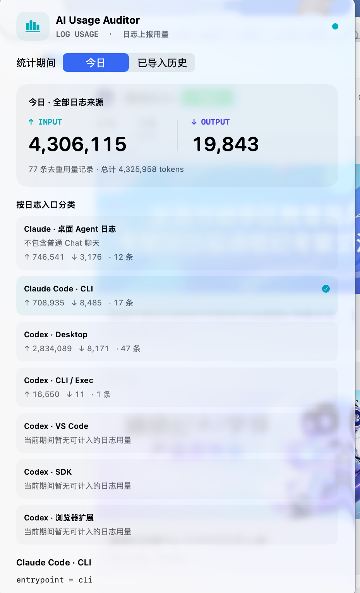

# Agent Meter（编程 Agent 用量计）

[English](README.md) · [中文](README.zh-CN.md)

一款本地运行的 macOS 菜单栏应用，读取 **Claude Code** 和 **Codex** 的日志文件，按产生来源分组展示日志中记录的 token 用量。

无需 API key、代理、证书或「辅助功能」权限。所有数据都不会离开你的电脑。

> **这里显示的是日志记录的 token 数，既不是你的订阅额度，也不是账单。**
> 它只覆盖 Claude 编程 agent 和 Codex 会话，不包含普通的 Claude 和 ChatGPT 对话。费用数字是按公开单价折算的估算，不是账单 —— 见[费用估算](#费用估算)。

## 界面截图



今日全部日志来源的合计，并按日志入口分类展开。

## 安装

从 [Releases](https://github.com/choiking/AIUsageAuditor/releases) 下载最新的 `.zip`，解压后把 **Agent Meter.app** 拖进「应用程序」。

该构建使用 ad-hoc 签名且未经过公证（notarize），因此首次打开时会被 macOS 拦截，提示信息常常会误导性地说应用「已损坏」。这其实只是隔离（quarantine）标记。**右键点击应用 → 打开 → 打开**，或执行：

```sh
xattr -dr com.apple.quarantine "/Applications/Agent Meter.app"
```

需要 **Apple Silicon** 芯片和 **macOS 13 及以上**。Intel 芯片和 macOS 13 上的实际表现未经验证。从源码自行构建则完全不会遇到上述 Gatekeeper 拦截。

## 使用

点击菜单栏上的 token 总数即可打开面板。也可以直接显示：

```sh
open "build/Agent Meter.app" --args --show
```

面板分为**「用量」**和**「分析」**两个标签页。「用量」下又分 **Today（今天）** 和 **Imported history（导入的历史）** 两个区间，展示输入/输出总量、缓存明细、Codex 推理（reasoning）明细、各来源的记录数、最近一次用量时间，以及明确的数据质量警告。无论面板切换到哪个区间，菜单栏始终显示今天已接受的输入/输出。

来源列表分为两层。**Claude Code** 和 **Codex** 是顶层分类，各自显示该工具的合计；其下的入口行再按具体来源拆分。两个分类**默认折叠**，并标注各自包含多少个入口——点击即可展开并选中该分类。点选任意一层都会切换下方的明细，且顶层的数字正好等于其下各入口行之和。若折叠时选中的是其下某个入口，选中项会自动上移到该分类，避免明细描述一个已隐藏的行。展开状态仅在本次运行中有效，不会跨启动保留。

首次扫描会导入保留下来的历史记录。之后每五秒检查一次，且只读取新追加的字节。暂停会停止本次运行的扫描，恢复后会补齐期间的数据。切换来源只改变展示的明细，不改变监控范围。

**某个区间显示为零，意味着没有找到该区间的有效本地记录，而不是说账号没有产生任何消耗。** 可以通过来源的「最近用量时间」来区分陈旧历史和新近用量。

## 内容分析

“分析”标签页按用户提示词分为编程开发、排错测试、研究问答、写作翻译、设计创作、规划管理和其他。可切换“今日 / 历史”（历史包含今日）、筛选来源、点击分类、搜索并展开提示词，同时查看当前期间与来源的会话数、AI 回复记录数和工具活动。

分类使用本地中英文关键词规则，可能误分；占比按提示词条数计算，不代表 token 占比。已过滤已知系统上下文、工具结果、Claude 子代理任务与 Codex 内部审批／子代理会话，未识别的注入内容仍可能混入。Claude 流式快照与日志副本会去重；Codex 同文且相差不超过 5 秒的 event/response 副本会合并。AI 回复记录数不等于模型请求次数。工具错误只统计 Claude 明确标记的失败，暂不解析 Codex 错误。

内容仅在打开分析页后读取到内存，并随采集刷新，不上传，也不写入用量账本。每条提示词最多用前 12,000 字符进行分类和展示。历史只覆盖仍存在的来源日志，删除日志后对应内容会在下次扫描移除；已保存的数值用量历史不受影响。大日志分批导入，未完成时会提示。

只查看汇总、不打印提示词：`./build/LogInspector --analysis`。

## 数据来源

| 路径 | 读取字段 |
| --- | --- |
| `~/.claude/projects/**/*.jsonl`（含 subagent 日志） | `assistant.message.usage` |
| `~/.codex/sessions/**/rollout-*.jsonl`<br>`~/.codex/archived_sessions/**/rollout-*.jsonl` | `event_msg` → `token_count` → `payload.info` |

若在应用的启动环境中设置了 `CLAUDE_CONFIG_DIR` 和 `CODEX_HOME`，会覆盖对应的基础目录。通过访达（Finder）启动时可能无法继承终端里的环境变量。

来源分类完全依据日志中记录的入口点，绝不根据进程名猜测：

| 日志元数据 | 显示为 |
| --- | --- |
| Claude `entrypoint = claude-desktop` | Claude Code · 桌面端 |
| Claude `cli` | Claude Code CLI |
| Claude `claude-vscode` / `vscode` | Claude Code IDE |
| Claude `sdk-cli` / `sdk` | Claude Code SDK |
| Codex `originator = Codex Desktop` / `codex_work_desktop` | Codex Desktop |
| Codex `codex_cli_rs` / `codex-tui` / `codex_exec` | Codex CLI / Exec |
| Codex `codex_vscode` | Codex VS Code |
| Codex `codex_sdk_ts` | Codex SDK |
| Codex `codex-chrome-extension-sidepanel` | Codex 浏览器扩展 |
| 缺失或无法识别 | 未知来源 |

这里有两点需要说明。其一，Codex 中笼统的 `source: vscode` 不会覆盖明确的 `originator: Codex Desktop`。其二，`claude-desktop` 指的是**在 Claude 桌面 App 内运行的 Claude Code**，而不是桌面 App 的 Chat 标签页——每一条这样的记录都带有工作目录（`cwd`）和 git 分支，而普通聊天对话并没有这些字段。上面四行 Claude 来源其实是同一个产品在不同入口的运行形态；普通的 Claude 聊天用量根本不会出现在这里。分类依据的是记录下来的入口点，而非客户端用的是 API key 还是订阅登录。应用不会读取任何凭据来推断计费方式。

## 计数方式

**Claude。** 流式快照和复制产生的历史记录，会基于哈希后的 request/message ID 做全局去重，保留时间戳最新的一条。时间相同但内容冲突的快照会被排除，直到出现更新的记录。输入 = 未缓存输入 + 缓存读取输入 + 缓存创建输入；输出按日志报告值计。各项明细已经包含在输入之内。

**Codex。** 用量取同一会话中相邻累计计数器的差值。重复的总计值和仅含限流信息的事件不会增加用量。`last_token_usage` 不会被单独累加。缓存计数属于输入明细，reasoning 属于输出明细，`total_tokens` 则直接采用。任一被跟踪字段出现计数回退，该会话会被整体排除并给出警告——是否属于计数器重置，这里刻意不做自动判断。

**日期。** 以日志时间戳确定本地自然日。Codex 会话的首个累计快照如果与其最后一次调用对不上，可能是继承或被裁剪过的历史，因此只计入历史，不计入今天。

这里的一条「记录」指的是一次去重后的用量增量，不一定对应一条消息、一次请求或一行账单。缺失的可选计数器会标注为「部分未报告」；格式错误的记录会显示为排除项，而不会被编造成零。

## Token 明细

明细区会列出所选工具上报的每一项 token 计数，每行都标注其对应的 JSONL 字段，便于把数字追溯回原始日志，而不是只能选择相信。

**Claude Code** 上报的是每轮的用量，其缓存计数是输入的组成部分：

| 行 | 字段 |
| --- | --- |
| 未缓存输入 | `input_tokens` |
| 缓存读取 | `cache_read_input_tokens` |
| 缓存写入 | `cache_creation_input_tokens` |
| — 1 小时 TTL | `cache_creation.ephemeral_1h_input_tokens` |
| — 5 分钟 TTL | `cache_creation.ephemeral_5m_input_tokens` |
| 输出 | `output_tokens` |

前三项相加即为 INPUT；两种 TTL 相加即为缓存写入。

**Codex** 上报的是会话累计值，因此显示的每个数字都是相邻计数之差。其缓存与推理计数是已包含在输入 / 输出之内的细分：

| 行 | 字段 |
| --- | --- |
| 输入 | `input_tokens` |
| — 其中缓存读取 | `cached_input_tokens` |
| — 其中缓存写入 | `cache_write_input_tokens` |
| 输出 | `output_tokens` |
| — 其中推理 | `reasoning_output_tokens` |
| 合计 | `total_tokens` |

Codex 不上报缓存写入的 TTL 拆分。记录中缺失的计数会显示为「部分未上报」，而不会当作零。

## 费用估算

每个来源都会显示其 token **按公开 API 目录价**折算的金额。这是对目录价的估算，不是实际支出记录：

- **日志中没有任何计费方式的信息。** 如果你用的是 Claude 或 ChatGPT 订阅，那是按月固定付费，这个数字和你被扣的钱没有关系。它回答的只是「这些 token 按 API 单价值多少钱」。
- **内置单价的生效日期为 2026-06-24**，官方调价后即会过期。
- 缓存 token 按各自的费率计价——读取为基础输入价的 0.1 倍，写入为 1.25 倍（5 分钟 TTL）或 2 倍（1 小时 TTL）。Claude 日志会分别记录这两种写入 TTL，因此按实际拆分计价，而不是假定。若某条记录没有提供拆分，则按较便宜的 5 分钟费率计算。
- **Codex 系列模型默认没有单价。** 本项目没有其官方费率的可靠来源，与其编造数字，不如把这些记录计为「未定价」并明确说明。由于你的用量很可能以 Codex 为主，请预期该估算只覆盖其中一小部分 token。
- 模型未知或没有单价的记录不计入金额，并单独统计——与处理无法识别来源时相同的「失败即排除」原则。

如需补充或覆盖单价，请创建 `~/Library/Application Support/AIUsageAuditor/pricing.json`。数值单位为「美元 / 百万 token」；其中的条目会覆盖内置表，文件格式错误时会被忽略，而不会把表清零。

```json
{
  "effective": "2026-09-15",
  "rates": {
    "gpt-6-astra": { "input": 4, "output": 16, "cacheRead": 0.4, "cacheWrite5m": 5, "cacheWrite1h": 8 }
  }
}
```

## 隐私

账本文件位于 `~/Library/Application Support/AIUsageAuditor/log-usage.json`（该目录沿用改名为 Agent Meter 之前的旧名，以免早期版本写入的历史记录失联），以原子方式写入，文件权限 `0600`，目录权限 `0700`。其中仅保存数值快照、时间戳、已识别的来源元数据、哈希后的标识和读取检查点。

**账本绝不保存 prompt、模型回复、工具输出、项目路径、原始 session/request ID 或任何凭据。** 源 JSONL 文件本身确实包含对话内容，但解析全程在本地内存中完成。`diagnostics.json` 只记录聚合的扫描状态和各来源计数。

唯一会处理 prompt 正文的地方是**「分析」标签页**。打开它时，会基于同样的本地 JSONL 在内存中建立一份索引，涵盖 prompt、模型回复、工具调用和工具报错，并按关键词把每条 prompt 归入七个分类之一，支持搜索和阅读。该索引按需构建、从不写入磁盘、退出即丢弃——但这个标签页确实会在屏幕上显示你的 prompt 正文，因此请把它当作任何一个会显示对话内容的窗口来对待。「用量」标签页和菜单栏只读取计数，不涉及正文。

读取检查点只在整行完整时才推进。不完整的追加写入会重试；被原地替换或截断的文件会重新构建；来自已删除或已轮转路径的、已脱敏的历史记录会保留。账本损坏时会原样保留并停止导入；写入失败不会让未保存的总数生效。运行中的应用会在 `log-usage.lock` 上持有一个建议性写锁。

## 构建

```sh
./scripts/test.sh --disable-sandbox
./scripts/build-app.sh --disable-sandbox
```

`--disable-sandbox` 针对的是 SwiftPM 的构建过程，与应用权限无关。`AUDITOR_BUILD_ROOT` 可覆盖构建缓存位置；Xcode 的共享 scheme 名为 `AgentMeter`。

```sh
./build/LogInspector                                  # 与 GUI 相同的扫描器，默认不持久化
./build/LogInspector --state /tmp/auditor-check.json  # 临时文件——切勿指向正在使用的账本
python3 scripts/generate_project.py                   # 重新生成 Xcode 工程
```

42 个 Swift 测试覆盖了来源分类、流式与冲突处理、复制的 fork/归档历史、累计计数器、计数回退、历史归属、部分写入、重启幂等性、删除的历史、文件截断、脱敏、账本损坏和写入失败等场景。

## 局限

- 远程和云端用量只有在本地存在记录时才可见。安装之前的历史无法找回。
- 这些本地日志格式可能随工具版本变化。
- 被改写了标识或时间戳的复制历史可能无法去重。原地改写会替换该文件已缓存的记录。
- 旧记录中缺失的可选计数字段，不会被默认当作「所有记录都会上报」。
- 每次扫描每个文件最多读取 32 MiB；超过 8 MiB 的单条记录会被跳过。
- 费用数字只是对上报 token 做目录价算术，不考虑订阅、折扣、批量或优先级定价、免费额度和各云厂商的单独费率。
- 来源的时间范围并不能证明日志完整保留，也不代表覆盖了账号的全部用量。
- v0.3 版本不再轮询「辅助功能」，也不再把可见文本的估算值并入总数。遗留的 core 和 inspector 工具仅作参考保留；`scripts/proxy*` 属于实验性工具，应用从不运行它们。

schema 与来源证据见 [`Docs/JSONL_USAGE_VALIDATION.md`](Docs/JSONL_USAGE_VALIDATION.md)，早期针对普通桌面端日志的调查见 [`Docs/LOG_CAPTURE_VALIDATION.md`](Docs/LOG_CAPTURE_VALIDATION.md)。

## 许可证

[MIT](LICENSE)
